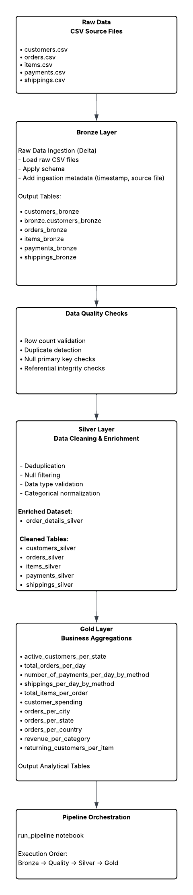
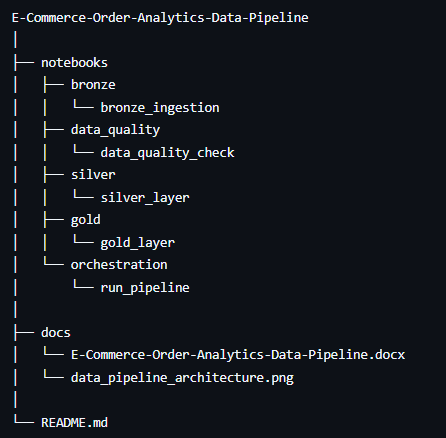

# 1. Project Overview
This project implements an end-to-end data engineering pipeline on Databricks Community Edition to process and transform transactional e-commerce data into an analytics-ready data model.

The pipeline ingests raw operational datasets related to customers, orders, purchased items, payments, and shipping details. Using PySpark on the Databricks platform, the data is cleaned, validated, transformed, and modeled into curated datasets optimized for analytics workloads.

The project demonstrates core data engineering skills including distributed data processing, ETL pipeline development, data modeling, and performance optimization within a cloud-based analytics environment.

# 2. Business Problem
Operational e-commerce systems typically store data in normalized transactional tables optimized for application operations rather than analytics.

Business teams require insights such as:

- Which product category generate the most revenue
- What payment methods are most commonly used
- Which geographic regions generate the highest order volumes

To answer these questions, raw operational data must be integrated and transformed into analytics-ready datasets. This project builds a scalable data pipeline to enable such analysis.

# 3. Technology Stack

- **Platform**:  Databricks Community Edition

- **Processing Engine**:  Apache Spark (PySpark)

- **Language**:  Python

- **Storage Format**:  CSV (raw layer) and Parquet structured outputs from Delta tables

- **Notebook Environment**:  Databricks Notebooks

- **Version Control**:  Github 

# 4. Data Sources

The project processes five primary datasets representing different entities in an e-commerce system:

- **customers.csv**  Customer demographic and registration information

- **orders.csv**  Order level transactional data

- **items.csv**   Product level details within each order

- **payments.csv**  Payment transaction information

- **shippings.csv**  Order shipping and logistics details

# 5. Data Pipeline Architecture

Step 1 – Data Ingestion : Bronze Layer

- Raw CSV files are loaded into Spark DataFrames using schema inference and basic validation.

Step 2 - Data Quality Checks
- Row count validation
- Duplicate detection
- Null primary key checks
- Referential integrity checks

Step 3  – Data Cleaning : Silver Layer

- Handling missing values
- Removing duplicates
- Validating primary key relationships
- Ensuring valid monetary values

Step 4 – Data Transformation : Silver Layer

- Datasets are joined to construct a unified order lifecycle dataset combining:
- Customer information
- Order details
- Item data
- Payment information
- Shipping information

Step 5 – Aggregations : Gold Layer

Following list describes the aggregations performed on each table generated in silver layer to get a gold layer table:
- active_customers_per_state(): Calculates the number of active customers in each state by grouping customer records by state and counting customer identifiers.
- total_orders_per_day(): Calculates daily order volume by grouping orders by order_date and counting the number of orders placed each day.
- number_of_payments_per_day_by_method(): Analyzes daily payment activity by grouping payments by date and pivoting on payment_method to count the number of payments made using each method per day.
- shippings_per_day_by_method(): Tracks shipping activity by grouping shipment records by date and pivoting on shipping_method to count shipments per method each day.
- total_items_per_order(): Calculates the number of items included in each order by grouping the enriched order dataset by order_id and counting item records.
- customer_spending(): Computes total spending per customer by aggregating order values across all orders associated with each customer.
- orders_per_city(): Calculates the number of orders placed in each city by grouping the enriched dataset by customer city.
- orders_per_state(): Calculates the number of orders placed in each state by grouping the enriched dataset by customer state.
- orders_per_country() : Calculates the number of orders placed in each country by grouping the enriched dataset by customer country.
- revenue_per_category(): Calculates total revenue generated per product category by summing item prices grouped by product category.
- returning_customers_per_item(): Identifies items purchased repeatedly by customers by grouping item purchases and counting distinct customers who purchased the same item multiple times.

Step 6 –  Optimization : Overall code-base (In-progress)
- Repartitioning datasets
- Caching frequently used DataFrames
- Efficient join strategies
- Column pruning to reduce memory usage.

# 6. Project Structure

## Project Structure

# 7. Key Skills Demonstrated

- Building distributed ETL pipelines using PySpark
- Working with Databricks
- Data cleaning and transformation
- Joining multiple relational datasets
- Designing analytics-ready data models
- Applying Spark performance optimizations
- Preparing datasets for BI and machine learning applications

## Please find more details at docs/E-Commerce-Order-Analytics-Data-Pipeline.docx
